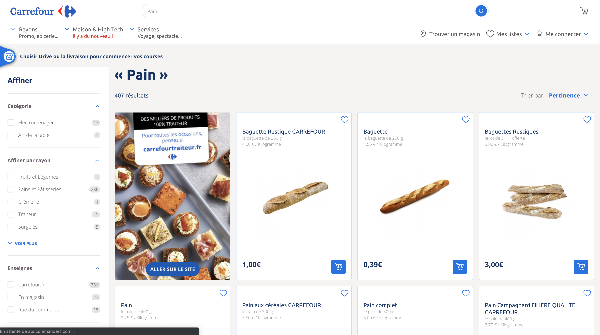

# Elasticsearch and Kibana

## Commands

- Launch elasticsearch node : `$ {node_path}/bin/elasticsearch`
- Launch kibana node : `$ {kibana_path}/bin/kibana`

## Get local kibana monitoring
1. Launch elasticsearch node(s)
2. configure kibana hosts in `apps/kibana/config/kibana.yml:28` with the node(s) http.port:
```
elasticsearch.hosts: ["http://localhost:9201"]
```
3. Launch Kibana

_If there is issues :_
1. Stop node(s)
2. Delete `/data` folders in the node(s)
3. Launche again the node(s)

**Be careful** is you are running only one node, comment the `discovery.zen.minimum_master_nodes` configuration in `elasticsearch.yml` file.

## Kibana routes

```
# Get all nodes infos
GET _nodes

# Get nodes infos on a row
GET _cat/nodes

# Get nodes infos on a row with head vizualisation
GET _cat/nodes?v

# Get cluster infos
GET _cluster/health

# Analyse string with french analyser
GET _analyze 
{
    "text": ["String"],
    "analyzer": "french"
}

# Get existing schema
GET french_example/?include_type_name=false
```

Pour avoir l'explication de la route et des actions effectuées, il faut rajouter `"explain": true` dans la query :
```
GET _analyze 
{
    "text": ["String"],
    "analyzer": "french",
    "explain": true
}
```

## Elasticsearch analyser

L'analyser par défaut d'Elasticsearch n'est pas optimisé.

[Default Eslasticsearch analysers](https://www.elastic.co/guide/en/elasticsearch/reference/6.7/analysis-lang-analyzer.html)

Elasticsearch index les strings envoyés de cette manière :
- sans majuscule
- sans accent
- supprime les mots dit de "bruit" : je, a, du...
- sur la même racine pour enlever les pluriels, féminins, masculins...

Cet ordre est défini par les "filtres" des analyser :

```
"filter": [
            "french_elision",
            "lowercase",
            "french_stop",
            "french_keywords",
            "french_stemmer"
          ]
```

**Problème** : il y a des soucis avec les tag HTLM et les noms propres.

Exemple: 

Route:
```
GET _analyze
{
  "text": ["Développeuse"],
  "analyzer": "french"
}
```

Result: 
```
{
  "tokens" : [
    {
      "token" : "developeu",
      "start_offset" : 0,
      "end_offset" : 12,
      "type" : "<ALPHANUM>",
      "position" : 0
    }
  ]
}
```

### Redéfinition d'un analyser

On peut définir notre propre analyser pour l'améliorer. On prend celui par défault :
```
DELETE french_example
PUT /french_example
{
  "settings": {
    "number_of_shards": 1, 
    "analysis": {
      "filter": {
        "french_elision": {
          "type":         "elision",
          "articles_case": true,
          "articles": [
              "l", "m", "t", "qu", "n", "s",
              "j", "d", "c", "jusqu", "quoiqu",
              "lorsqu", "puisqu"
            ]
        },
        "french_stop": {
          "type":       "stop",
          "stopwords":  "_french_" 
        },
        "french_keywords": {
          "type":       "keyword_marker",
          "keywords":   ["Exemple"] 
        },
        "french_stemmer": {
          "type":       "stemmer",
          "language":   "light_french"
        }
      },
      "analyzer": {
        "esgi_french": {
          "tokenizer":  "standard",
          "filter": [
            "french_elision",
            "lowercase",
            "french_stop",
            "french_keywords",
            "french_stemmer"
          ]
        }
      }
    }
  }
}
```

Ensuite on peut utiliser cet analyser comme ceci :

```
GET french_example/_analyze
{
  "text": ["Développeuse"],
  "analyzer": "esgi_french"
}
```
**Attention à utiliser** `french_example/_analyze` pour utiliser l'index `french_example` sur lequel on a crée notre analyser `esgi-french`

#### Comment supporter les tag html ?

Rajouter : `"char_filter": ["html_strip"],` dans l'analyser custom

[Documentation](https://www.elastic.co/guide/en/elasticsearch/reference/current/analysis-htmlstrip-charfilter.html)

Exemple avec `<b>Je suis dev</b>`

#### Comment garder les noms propres ?

Il faut protéger les mots du french keyword qui réduit la string sur sa forme racine.
Pour protéger des mots précis, on peut ajouter des exceptions :

```
        "french_keywords": {
          "type":       "keyword_marker",
          "keywords":   ["barbie", "gilette"] 
        },
```

Le **problème** ici est qu'il faut avoir un dictionnaire de marque (dans un contexte e-commerce par exemple).
De plus la donnée est **non structurée** car on peut envoyer des choux ou des carottes sans savoir.

On peut donc définir un schéma d'index avec des champs.

### Schema d'index

On peut envoyer par exemple : 

```
POST french_example/_doc/1
{
  "id": 1,
  "prix": 1,
  "libelle": "Eau Evian 50cl",
  "marque": "Evian"
}

POST french_example/_doc/2
{
  "id": 2,
  "prix": 39.99,
  "libelle": "Poupée Barbie rose",
  "marque": "Barbie"
}

POST french_example/_doc/3
{
  "id": "k3",
  "prix": 39.99,
  "libelle": "Poupée Barbie rose",
  "marque": "Barbie"
}
```

On peut, si on utilise le schema de base, avoir des problème nottament avec les id qui ne sont pas des int, les prix qui sont des float etc.

Il faut donc update le schema et nottament le **mapping**.

#### Mapping 

[Doc mapping](https://www.elastic.co/guide/en/elasticsearch/reference/current/mapping.html)

```
PUT my_index 
{
  "mappings": {
    "_doc": { 
      "properties": { 
        "title":    { "type": "text"  }, 
        "name":     { "type": "text"  }, 
        "age":      { "type": "integer" },  
        "created":  {
          "type":   "date", 
          "format": "strict_date_optional_time||epoch_millis"
        }
      }
    }
  }
}
```

Exemple de schema avec le mapping des champs :

```
DELETE french_example
PUT /french_example?include_type_name=false
{
  "settings": {
    "number_of_shards": 1,
    "analysis": {
      "filter": {
        "french_elision": {
          "type": "elision",
          "articles_case": true,
          "articles": [
            "l",
            "m",
            "t",
            "qu",
            "n",
            "s",
            "j",
            "d",
            "c",
            "jusqu",
            "quoiqu",
            "lorsqu",
            "puisqu"
          ]
        },
        "french_stop": {
          "type": "stop",
          "stopwords": "_french_"
        },
        "french_keywords": {
          "type": "keyword_marker",
          "keywords": [
            "croix",
            "barbie",
            "gillette"
          ]
        },
        "french_stemmer": {
          "type": "stemmer",
          "language": "light_french"
        }
      },
      "analyzer": {
        "esgi_french": {
          "char_filter": [
            "html_strip"
          ],
          "tokenizer": "standard",
          "filter": [
            "french_elision",
            "lowercase",
            "french_stop",
            "french_keywords",
            "french_stemmer"
          ]
        }
      }
    }
  },
  "mappings": {
    "properties": {
      "id": {
        "type": "keyword"
      },
      "libelle": {
        "type": "text",
        "analyzer": "esgi_french"
      },
      "marque": {
        "type": "text",
        "analyzer": "whitespace",
        "fields": {
          "keyword": {
            "type": "keyword",
            "ignore_above": 256
          }
        }
      },
      "prix": {
        "type": "float"
      }
    }
  }
}
```

## Analyser open-source
[Phonetic French Analyser](https://github.com/hcapitaine/french-phonetic-analyser)


# Cours 2 

Moteur de recherche scalable à l'infini. Scalabilité horizontal car plus on a besoin de recherche etc, plus on peut ajouter de clusters à l'oposé d'une scalabilité verticale dite de hardware qui est limitée.

Un **cluster** c'est un regroupement de noeuds.
Le cluster a 3 status : 
- green : tout OK
- yellow : Il y a un risque de perdre des datas si ya un problème
- red : NOK

Un cluster gère les shards des index pour gérer les problème. Il y a un mécanisme pour gérer la dispo des données. Il y a donc la donnée primaire (copie principale) et des duplicat. 

Donc un cluster gère la réplication de la donnée (la résilience de donnée) dans les shards.
Cette gestion des copies principales et duplicats est interdit sur le même noeuds. Donc si on a pas assez de noeuds pour faire la résoliance, le cluster se met en état jaune.


Les **noeuds** sont des instances d'elasticsearch qui peuvent communiqués entre eux. Ils peuvent avoir plusieurs types : 
- data => contient de la donnée.
- master => gère les indexes de données et chaque index 
- ingest => envoi de la donnée
Il est important de pas mettre les 3 types de noeuds au même noeud car ils auront trop de choses à gérer. 

Un **index** est l'organisation de shards.

Un **shard** est composé de plusieurs segments.

Un **segment** sont des data immuables à un niveau très bas.


Un **analyser** regroupe le caracter filter, le tokeniser ensuite le token filter. Il est utiliser pour les recherches de haut niveau, full text.


## 1. API de recherche

- API REST elasticsearch -> client applicatif
- HTTP:9200
- client : postman, browser, kibana
- méthodes http : get put patch delete


`GET _search`
result : 
```
{
  "took" : 6, ==> le temps que ça a pris 
  "timed_out" : false,
  "_shards" : {
    "total" : 3, ==> total des shards qui ont rep
    "successful" : 3, ==> ceux qui sont OK
    "skipped" : 0, ==> ceux qui ont été ignorés
    "failed" : 0 ==> ceux qui ont fail
    },
    "hits" : {
    "total" : 6, ==> nombre total de result
    "max_score" : 1.0, ==> score de pertinance
    "hits" : [ ==> 
      {
        "_index" : ".kibana_1",
        "_type" : "doc",
        "_id" : "space:default",
        "_score" : 1.0,
        "_source" : {
          "space" : {
            "name" : "Default",
            "description" : "This is your default space!",
            "color" : "#00bfb3",
            "_reserved" : true
          },
          "type" : "space",
          "updated_at" : "2019-04-10T12:56:36.542Z"
        }
      },
```

## 2. Filtres et requêtes

Recherche structurée VS non-structurée

### Structurée :
- une seule val strictement identifié
- nom du pays = France
- année > 2018
- une réponse binaire : oui/non

### Non-structurée : 
- plusieurs "éléments" de la donnée
- Mer du nord contient le mot nord
- la réponse intègre un score de pertinence

### Contexte de filtre :
- Oui ou non le doc répond à la recherche
- avec données structurée

### Contexte de requête :
- Dans quelle mesure le doc correspond à la recherche
- reponse avec un score de pertinence
- données non structurée, full text
 

## 3. Différents types de requêtes

### Term-based

- bas niveau
- sans phrase d'analyse
- un seul mot
- exemple : term, termes, range, exists, fuzzy

### Full text

- haut niveau
- utilise analyseur associé au champ pour transformer la requête
- exemples : match_all, match, multi_match


## Exercices : La Recherche

### Définir l'index pays

```
DELETE pays
PUT pays 
{
  "mappings": {
    "_doc": { 
      "properties": { 
        "nom": { "type": "text" }, 
        "capital": { "type": "text" }, 
        "population_million": { "type": "integer"},
        "description": {"type": "text"}
      }
    }
  }
}
```

Récupérer le mapping d'un index : 
```
GET pays/_mapping
```

### Ajouter des données à l'index 

```
POST pays/_doc/
{
  "nom": "France",
  "capitale": "Paris",
  "population_million": 300,
  "description": "La France, du fromage, du pain, du vin etc"
}

POST pays/_doc/
{
  "nom": "Espagne",
  "capitale": "Madrid",
  "population_million": 150,
  "description": "Un, dos, tres, un pacito para Maria"
}
```

On peut très bien ajouter de la donnée à la volée sans mapping, ça va le générer automatiquement.

### Récupérer la donnée : 

```
GET pays/_search
GET pays/_search?q=nom:France
```

Analyser la donnée : 

```
GET pays/_analyze 
{
  "text": ["France"]
}
```

### Récupérer la donnée avec des intervales

```
GET pays/_search
{
  "query" : {
    "range" : {
      "population_million": {
        "gt" : 155
      }
    }
  }
}
```

### Vérifier si un champs existe dans un index

```
GET pays/_search
{
  "query" : { 
    "exists" : {
      "field" : "nom"
    }
  }
}
```

## Exercices : Les jointures

### #1. Type "Nested"

Le type nested est la modalité d'introduire une strucutre plus élaborée à l'interieur d'un index.

Exemple de plusieurs niveaux d'imbrications dans un index "article" :

```
POST articles/_doc/veste1
{
  "nom": "Veste en cuir",
  "desription": "Magnifique veste en cuir",
  "caract": [
    {
      "taille": "Small",
      "couleur": "White"
    }
  ]
}
POST articles/_doc/veste2
{
  "nom": "Veste en cuir new generation",
  "desription": "Magnifique veste en cuir new generation",
  "caract": [
    {
      "taille": "Small",
      "couleur": "Black"
    }
  ]
}
POST articles/_doc/pull1
{
  "nom": "Pull de laine",
  "desription": "Magnifique pull en laine",
  "caract": [
    {
      "taille": "Large",
      "couleur": "Black"
    }
  ]
}
POST articles/_doc/pull2
{
  "nom": "Pull de laine",
  "desription": "Magnifique pull en laine",
  "caract": [
    {
      "taille": "Small",
      "couleur": "White"
    }
  ]
}
POST articles/_doc/tshort1
{
  "nom": "T-Shirt en jean",
  "desription": "Magnifique T-Shirt en jean",
  "caract": [
    {
      "taille": "Medium",
      "couleur": "Yellow"
    }
  ]
}
```

Commandes de bases : 

```
GET articles/_search
GET articles/_mapping
DELETE articles
```

Result du mapping : 

```
{
  "articles" : {
    "mappings" : {
      "_doc" : {
        "properties" : {
          "caract" : {
            "properties" : {
              "couleur" : {
                *{data}
              },
              "taille" : {
                *{data}
              }
            }
          },
          "desription" : {
            *{data}
          },
          "nom" : {
            *{data}
          }
        }
      }
    }
  }
}

*{data}: {
 "type" : "text",
 "fields" : {
   "keyword" : {
     "type" : "keyword",
     "ignore_above" : 256
   }
 }
```

Recherche via une caract avec le type nested : 

```
GET /articles/_search
{
  "query": {
    "bool": {
      "must": [
        {
          "nested": {
            "path": "caract",
            "score_mode": "max", 
            "query": {
              "bool": {
                "must": [
                  {
                    "match": {
                      "caract.taille": "Small"
                    }
                    
                  },
                  {
                    "match": {
                      "caract.couleur": "Black"
                    }
                  }
                ]
              }
            }
          }
        }
      ]
    }
  }
}
```

Pour que ça marche, il faut rajouter un **mapping** qui défini le mapping avec un type nested : 

```
PUT articles 
{
  "mappings": {
    "_doc": { 
      "properties": { 
        "nom": { "type": "text" }, 
        "description": { "type": "text" }, 
        "caract": { 
          "type": "nested", 
          "properties": {
            "taille": { "type": "text" },
            "couleur": { "type": "text" }
          }
        }
      }
    }
  }
}
```

On se retrouve donc uniquement avec le produit qui a les deux valeurs de la query de la recherche.

### #2. Type "Join" : relation document parent/enfant

C'est la modalité pour implémenter des jointures entre plusieurs index.

Le type join permet d'appeler les deux catégories de documents dans un seul et même index.

Il faut donc : 
1. Faire le mapping de l'index

```
PUT administration_territoriale
{
  "mappings": {
    "_doc": {
      "properties": {
        "mon_administration": {
          "type": "join",
          "relations": {
            "region": "departement"
          }
        }
      }
    }
  }
}
```

2. Indexation du document parent

Indexation des régions
```

## Régions
PUT administration_territoriale/_doc/r1
{
  "nom_region": "Auvergne-Rhône-Alpes",
  "mon_administration": {
    "name": "region"
  }
}
PUT administration_territoriale/_doc/r10
{
  "nom_region": "Alsace-Champagne-Ardenne-Lorraine",
  "mon_administration": {
    "name": "region"
  }
}

```

3. Indexation du document enfant

Indexation des départements : 

```
## Départements
PUT administration_territoriale/_doc/d1?routing=r1
{
  "nom_departement": "Ain",
  "mon_administration": {
    "name": "departement",
    "parent": "r1"
  }
}
PUT administration_territoriale/_doc/d1?routing=r10
{
  "nom_departement": "Aube",
  "mon_administration": {
    "name": "departement",
    "parent": "r10"
  }
}
```

4. Recherche parent / enfant


Recherche des enfants par rapport à leur nom : 
```
GET administration_territoriale/_search
{
  "query": {
    "has_child": {
      "type": "departement",
      "query": {
        "term": {
          "nom_departement.keyword": {
            "value": "Aube"
          }
        }
      },
    "inner_hits": {}
    }
  }
}
```

Cela renvoi les document enfants (avec le document parent grace au inner_hits).
Result : 

```
{
  "took" : 40,
  "timed_out" : false,
  "_shards" : {
    "total" : 5,
    "successful" : 5,
    "skipped" : 0,
    "failed" : 0
  },
  "hits" : {
    "total" : 1,
    "max_score" : 1.0,
    "hits" : [
      {
        "_index" : "administration_territoriale",
        "_type" : "_doc",
        "_id" : "r10",
        "_score" : 1.0,
        "_source" : {
          "nom_region" : "Alsace-Champagne-Ardenne-Lorraine",
          "mon_administration" : {
            "name" : "region"
          }
        },
        "inner_hits" : {
          "departement" : {
            "hits" : {
              "total" : 1,
              "max_score" : 0.2876821,
              "hits" : [
                {
                  "_index" : "administration_territoriale",
                  "_type" : "_doc",
                  "_id" : "d1",
                  "_score" : 0.2876821,
                  "_routing" : "r10",
                  "_source" : {
                    "nom_departement" : "Aube",
                    "mon_administration" : {
                      "name" : "departement",
                      "parent" : "r10"
                    }
                  }
                }
              ]
            }
          }
        }
      }
    ]
  }
}
```

Recherche des parents par rapport à leur nom : 

```
GET administration_territoriale/_search
{
  "query": {
    "has_parent": {
      "parent_type": "region",
      "query": {
        "term": {
          "nom_region.keyword": {
            "value": "Alsace-Champagne-Ardenne-Lorraine"
          }
        }
      },
      "inner_hits": {}
    }
  }
}
```

result de tous les département avec leur région (Alsace-Champagne-Ardenne-Lorraine) : 

```
{
  "took" : 31,
  "timed_out" : false,
  "_shards" : {
    "total" : 5,
    "successful" : 5,
    "skipped" : 0,
    "failed" : 0
  },
  "hits" : {
    "total" : 1,
    "max_score" : 1.0,
    "hits" : [
      {
        "_index" : "administration_territoriale",
        "_type" : "_doc",
        "_id" : "d1",
        "_score" : 1.0,
        "_routing" : "r10",
        "_source" : {
          "nom_departement" : "Aube",
          "mon_administration" : {
            "name" : "departement",
            "parent" : "r10"
          }
        },
        "inner_hits" : {
          "region" : {
            "hits" : {
              "total" : 1,
              "max_score" : 0.2876821,
              "hits" : [
                {
                  "_index" : "administration_territoriale",
                  "_type" : "_doc",
                  "_id" : "r10",
                  "_score" : 0.2876821,
                  "_source" : {
                    "nom_region" : "Alsace-Champagne-Ardenne-Lorraine",
                    "mon_administration" : {
                      "name" : "region"
                    }
                  }
                }
              ]
            }
          }
        }
      }
    ]
  }
}
```

### #3. La recherche multi-cluster

Doc : using cross cluster search

### #4. La sauvegarde et la restauration

---

# Cours 3

## Questions :

1. Quels sont les types de noeud ?
    - Master
    - Data
    - Injest

    Mais y'en a d'autres comme machine-learning etc

2. De quoi est composé un index ?

    De shards

3. Comment elastic assure la disponibilité de la donnée ?

    Il duplique la donnée des shards sur l'ensemble des noeuds du cluster afin d'assurer la résilience des données.

4. A quoi correspond l'index et le type ?
    
    L'index correspond à la BDD et le type à la table en faisant un paralèle à une base de donnée structurelle
    
# Les agrégations :

#### Terminologie
**ATTENTION** une agrégation est aussi plus courament appelée **facette** ou **filtre non activé** en français. Ce n'est pas une donnée rentrée en dur dans le code, elle se génère automatiquement d'après le moteur de recherche.

## 0. Les cas d'utilisation

Sur le site de carrefour, quand on fait une recherche, des **facettes** se créées en fonction de la recherche pour afiner la recherches, ex: marque, couleur...



_Exemple d'agrégations (à droite) sur le site carrefour_


## 1. Indexation "bulk" pour exercice

Lancer cette commande pour indéxer la donnée du fichier dans le noeud lancé `localhost:9201`.
```
$ curl -XPOST -H "Content-Type: application/json" "http://localhost:9201/_bulk?pretty" --data-binary @earthquake_bulk.json
```

On peut ensuite faire des recherches sur ce doc sur kibana.


Pour créer un agrégation il faut le noeud `aggs` qui a le même fonctionnement que le group by sql.

```
GET earthquake/_search
{
  "size": 0, 
  "aggs": { 
    "facette_name": { 
      "terms": {
        "field": "source.keyword",
        "size": 10
      }
    }
  }
}
```

`"size": 0,` Pour ne pas remonter l'ensemble des résultats d'un document. Pour une question de pertinance et de performance ()

`"aggs": {}` Pour définir l'agrégation (ça marche aussi avec "aggregation")

`"facette_name": {` peut être utilisé par la suite pour faire référence aux valeurs de cette agrégation.

`"terms": {` C'est un type d'agrégation

### Retour

Cela retourne l'ensemble des résultats de manière décroissant avec chaque "clef" et le nombre de résultats pour cette clef : 

```
        {
          "key" : "OFFICIAL",
          "doc_count" : 8
        },
        {
          "key" : "UW",
          "doc_count" : 6
        },
        {
          "key" : "NN",
          "doc_count" : 4
        }
```

## 2. Les agrégations pour métrique

[Documentation agg metric](https://www.elastic.co/guide/en/elasticsearch/reference/6.5/search-aggregations-metrics.html)

Exemples : **min, max, avg** plutôt adapté à des valeurs nuériques pour des calculs mathématiques.

### Exercies :
1 . Quel est le tremblement de terre le plus faible ?
```
POST earthquake/_search?size=0
{
    "aggs" : {
        "min_magnitude" : { "min" : { "field" : "magnitude" } }
    }
}
```

result : 
```
  "aggregations" : {
    "min_magnitude" : {
      "value" : 5.5
    }
  }
```

2 . Quel est le tremblement de terre le plus fort ?

```
POST earthquake/_search?size=0
{
    "aggs" : {
        "max_magnitude" : { "max" : { "field" : "magnitude" } }
    }
}
```

result : 
```
  "aggregations" : {
    "max_magnitude" : {
      "value" : 9.100000381469727
    }
  }
```

3 . Quelle est la valeur moyenne de la magnitude enregistrée ?

```
POST earthquake/_search?size=0
{
    "aggs" : {
        "avg_magnitude" : { "avg" : { "field" : "magnitude" } }
    }
}
```

result :
```
  "aggregations" : {
    "avg_magnitude" : {
      "value" : 5.882542801771001
    }
  }
```

4 . Quelle est la somme de toutes les valeurs de magnitude enregistrée ?

```
POST earthquake/_search?size=0
{
    "aggs" : {
        "magnitude_sum" : { "sum" : { "field" : "magnitude" } }
    }
}
```

result :
```
  "aggregations" : {
    "magnitude_sum" : {
      "value" : 137716.2095322609
    }
  }
```

5 . **Sinon pour tout avoir :**

```
POST earthquake/_search?size=0
{
    "aggs" : {
        "magnitude_stats" : { 
          "extended_stats": { 
            "field" : "magnitude" 
          }
        }
    }
}
```
marche aussi avec `stats`

result: 
```
"aggregations" : {
    "magnitude_stats" : {
      "count" : 23411,
      "min" : 5.5,
      "max" : 9.100000381469727,
      "avg" : 5.882542801771001,
      "sum" : 137716.2095322609,
      "sum_of_squares" : 814311.6245206672,
      "variance" : 0.1789811391858131,
      "std_deviation" : 0.4230616257542311,
      "std_deviation_bounds" : {
        "upper" : 6.728666053279463,
        "lower" : 5.036419550262538
      }
    }
  }
```

## 3. Les agrégation de type "bucket"

[Documentation agg bucket](https://www.elastic.co/guide/en/elasticsearch/reference/6.5/search-aggregations-bucket.html)

Exemples : **terms, histogram, top_hits** plutôt adapté à des valeurs textuelles.

### Exercices : 
1 . Combien de catégories de tremblements de terre en fonction de la profondeur ?

```
POST earthquake/_search?size=0
{
    "aggs" : {
        "depth_histogram" : { 
          "histogram": { 
            "field" : "depth",
            "interval": 100
          }
        }
    }
}
```

`"field" : "depth",` On prend le champ profondeur

`"interval": 100` On défini un interval

result :
_Cela nous donnes le nombres de tremblements de terre qu'il y a eu pour chaque interval_
```
"aggregations" : {
    "exemple_basique" : {
      "buckets" : [
        {
          "key" : -100.0,
          "doc_count" : 1
        },
        {
          "key" : 0.0,
          "doc_count" : 19679
        },
        {
          "key" : 100.0,
          "doc_count" : 1926
        },
        {
          "key" : 200.0,
          "doc_count" : 478
        },
        {
          "key" : 300.0,
          "doc_count" : 190
        },
        {
          "key" : 400.0,
          "doc_count" : 215
        },
        {
          "key" : 500.0,
          "doc_count" : 617
        },
        {
          "key" : 600.0,
          "doc_count" : 304
        },
        {
          "key" : 700.0,
          "doc_count" : 1
        }
      ]
    }
  }
```

2 . Combien de tremblements de terre par année ?

```
POST earthquake/_search?size=0
{
    "aggs" : {
        "datetime_histogram" : { 
          "date_histogram": { 
            "field" : "@timestamp",
            "interval": "year"
          }
        }
    }
}
```

result :
```
        {
          "key_as_string" : "2016-01-01T00:00:00.000Z",
          "key" : 1451606400000,
          "doc_count" : 468
        },
        {
          "key_as_string" : "2017-01-01T00:00:00.000Z",
          "key" : 1483228800000,
          "doc_count" : 0
        },
        {
          "key_as_string" : "2018-01-01T00:00:00.000Z",
          "key" : 1514764800000,
          "doc_count" : 0
        },
        {
          "key_as_string" : "2019-01-01T00:00:00.000Z",
          "key" : 1546300800000,
          "doc_count" : 6
        }
```

3 . Quels sont les tremblements de terre entre 2011 et 2019 ?

```
POST earthquake/_search
{
    "query" : {
        "bool": {
          "filter": {
            "range": {
              "@timestamp": {
                "gte": "2011-01-01T00:00:00.000Z",
                "lte": "2019-01-01T00:00:00.000Z"
              }
            }
          }
        }
    }
}
```

result :
```
"hits" : {
    "total" : 3012,
    "max_score" : 0.0,
    "hits" : [
      {
        "_index" : "earthquake",
        "_type" : "_doc",
        "_id" : "2x1IsGoBHhJtY_dwZoo7",
        "_score" : 0.0,
        "_source" : {
          "location_source" : "US",
          "magnitude" : 5.9,
          "horizontal_distance" : null,
          "geoip" : {
            "lat" : 38.503,
            "lon" : 143.166
          },
          "datetime" : "03/09/201118:44:38",
          "azimuthal_gap" : "30.7",
          "magnitude_seismic_stations" : null,
          "source" : "US",
          "@timestamp" : "2011-03-09T17:44:38.000Z",
          "magnitude_type" : "MWW",
          "magnitude_source" : "US",
          "status" : "Reviewed",
          "id" : "USP000HVK9",
          "depth" : 23
        }
      },
      {
        "_index" : "earthquake",
        "_type" : "_doc",
        "_id" : "-x1IsGoBHhJtY_dwZoo7",
        "_score" : 0.0,
        "_source" : {
          "location_source" : "US",
          "magnitude" : 5.7,
          "horizontal_distance" : null,
          "geoip" : {
            "lat" : -11.013,
            "lon" : 166.303
          },
          "datetime" : "01/26/201117:03:30",
          "azimuthal_gap" : "27.8",
          "magnitude_seismic_stations" : null,
          "source" : "US",
          "@timestamp" : "2011-01-26T16:03:30.000Z",
          "magnitude_type" : "MWC",
          "magnitude_source" : "GCMT",
          "status" : "Reviewed",
          "id" : "USP000HTPB",
          "depth" : 148
        }
      },
```

Il y a aussi des agégations de type bucket avec missing` pour vérifier si un champs est manquant

## 4. L'agrégation "top hits"

Il correspond aux valeurs les plus élevées.

### Exercies :

1. Quels sont les tremblement de terre le plus profond ? 

```
POST earthquake/_search?size=0
{
    "aggs" : {
        "depth_top_hits" : { 
          "top_hits": { 
            "sort" : [
                {
                  "depth": {
                    "order": "desc"
                  }
                }
              ]
          }
        }
    }
}
```

result : cela donne les trois tremblements les plus profonds 
```
"aggregations" : {
    "depth_top_hits" : {
      "hits" : {
        "total" : 23411,
        "max_score" : null,
        "hits" : [
          {
            "_index" : "earthquake",
            "_type" : "_doc",
            "_id" : "zB1IsGoBHhJtY_dwZp9D",
            "_score" : null,
            "_source" : {
              "location_source" : "US",
              "magnitude" : 9.1,
              "horizontal_distance" : null,
              "geoip" : {
                "lat" : 38.297,
                "lon" : 142.373
              },
              "datetime" : "03/11/201105:46:24",
              "azimuthal_gap" : "9.5",
              "magnitude_seismic_stations" : null,
              "source" : "OFFICIAL",
              "@timestamp" : "2011-03-11T04:46:24.000Z",
              "magnitude_type" : "MWW",
              "magnitude_source" : "OFFICIAL",
              "status" : "Reviewed",
              "id" : "OFFICIAL20110311054624120_30",
              "depth" : 29
            },
            "sort" : [
              9.1
            ]
          },....
        ]
      }
    }
}
```

## 5. Les agrégations en cascade ou agg imbriquées ("pipeline aggregation")

On peut mettre une agrégation dans une agrégation. 

### Exercices: 
1. Quelle est la valeur moyenne de la magnitude enregistrée pour les tremblements de terre chaque année ?

Il faut découper cette requête en plusieurs agrégations : 
- Une agg date_histogram de chaque année
- Dans cet agg, une agg pour la moyenne de la magnitude

```
POST earthquake/_search?size=0
{
  "aggs": {
      "datetime_histogram_agg": { 
        "date_histogram": { 
          "field": "@timestamp",
          "interval": "year"
        },
        "aggs": {
          "magnitude_avg_agg": {
            "avg": { 
              "field": "magnitude"
              }
            }
        }
      }
  }
}
```

result :
```
"aggregations" : {
    "datetime_histogram_agg" : {
      "buckets" : [
        {
          "key_as_string" : "1965-01-01T00:00:00.000Z",
          "key" : -157766400000,
          "doc_count" : 339,
          "magnitude_avg_agg" : {
            "value" : 6.0141592771254455
          }
        },
        {
          "key_as_string" : "1966-01-01T00:00:00.000Z",
          "key" : -126230400000,
          "doc_count" : 234,
          "magnitude_avg_agg" : {
            "value" : 6.040470068271343
          }
        },
        {
          "key_as_string" : "1967-01-01T00:00:00.000Z",
          "key" : -94694400000,
          "doc_count" : 255,
          "magnitude_avg_agg" : {
            "value" : 6.003921531228459
          }
        },
      ]
    }
  }
}
```

_ici `"key" : -94694400000,` correspond au timestamp de la date `   "key_as_string" : "1967-01-01T00:00:00.000Z",1`. il est négatif car le timestamp 0 se trouve le 1er janvier 1970._

#### Agrégations en cascade

1 . Quelle est la plus grande valeur des moyennes de magnitude calculées pour les tremblements de terre chaque année.

Ici on a besoin de données qui n'existent pas dans le document pour avoir le résultat

```
POST earthquake/_search?size=0
{
  "aggs": {
      "datetime_histogram_agg": { 
        "date_histogram": { 
          "field": "@timestamp",
          "interval": "year"
        },
        "aggs": {
          "magnitude_avg_agg": {
            "avg": { 
              "field": "magnitude"
              }
            }
        }
      },
      "max_avg": {
      "max_bucket": {
        "buckets_path": "datetime_histogram_agg>magnitude_avg_agg"
      }
    }
  }
}
```

result :

```
"aggregations" : {
    "datetime_histogram_agg" : {
      "buckets" : [
        {
          "key_as_string" : "1965-01-01T00:00:00.000Z",
          "key" : -157766400000,
          "doc_count" : 339,
          "magnitude_avg_agg" : {
            "value" : 6.0141592771254455
          }
        },
        {
          "key_as_string" : "1966-01-01T00:00:00.000Z",
          "key" : -126230400000,
          "doc_count" : 234,
          "magnitude_avg_agg" : {
            "value" : 6.040470068271343
          }
        },
        {
          "key_as_string" : "1967-01-01T00:00:00.000Z",
          "key" : -94694400000,
          "doc_count" : 255,
          "magnitude_avg_agg" : {
            "value" : 6.003921531228459
          }
        },
       ]
    },
    "max_avg" : {
      "value" : 6.078524573904569,
      "keys" : [
        "1968-01-01T00:00:00.000Z"
      ]
    }
  }
}
```

# Projet annonces immobilières

[Notes projet](projet-immo.md)

