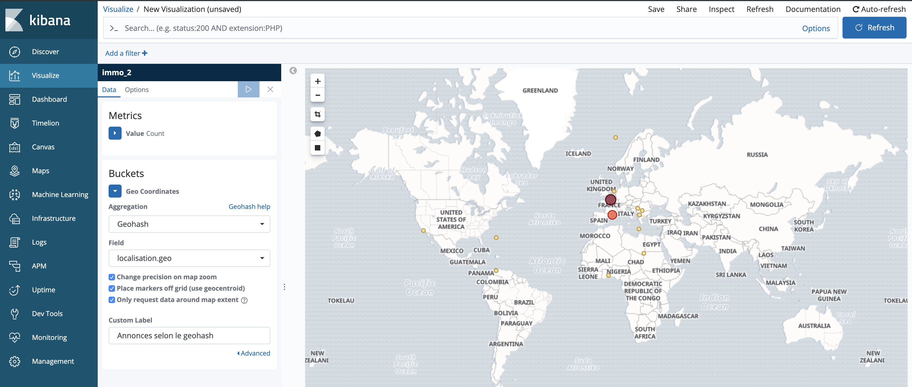

# PROJET IMMO

Un projet immobilier sous elasticsearch.

### Etapes : 
1. Faire un model de donnée 

On peut utilisé le geo point sur elasticsearch pour la géolocalisaiton : [Documentation geopoint](https://www.elastic.co/guide/en/elasticsearch/reference/current/geo-point.html)

2. Indexation
3. Requête de recherche
4. Aggrégations
5. Géolocalisation
6. Percolation

```
########## DONNEES IW3 ##########
PUT immo/_doc/1
{
  "titre": "2 pièces vue sur la Tour Eiffel",
  "description": "Beau deux pièces refait à neuf, dernier étage sans ascenseur, traversant et lumineux, cave et grenier",
  "superficie_m2": 42.28,
  "localisation": {
    "code_postal": "75015",
    "ville": "Paris",
    "geo": {
      "lat": 41.12,
      "lon": 2.34
    }
  },
  "prix_hc": 1600.8,
  "prix_cc": 1800.8,
  "type": "location",
  "nb_pieces": 2,
  "nb_chambres": 1,
  "date_publication": "2019-05-15",
  "parking": false,
  "haut_debit": true
}
PUT immo/_doc/42
{
  "titre": "Appartement de 80m², à 950000 €, Paris 75017",
  "description": "Dans un bel immeuble ancien et dans une copropriété bien tenue avec gardienne, un appartement traversant de 4 pièces de 77m2 Carrez typiquement parisien avec plan en étoile comprenant une entrée déversant toutes les pièces, un vaste séjour double de 30 m2 avec cheminée et poêle Prussien, une cuisine spacieuse et équipée, 2 belles chambres avec rangements, dressing, une salle de bains, salle d'eau avec WC et grande cave saine et aménagée.Le tout en parfait état dans un environnement de qualité avec tout le charme de l'ancien ",
  "superficie_m2": 80,
  "localisation": {
    "code_postal": "75017",
    "ville": "Paris",
    "geo": {
      "lat": 48.8806573,
      "lon": 2.2846554
    }
  },
  "prix_cc": 950000,
  "type": "achat",
  "nb_pieces": 3,
  "nb_chambres": 2,
  "date_publication": "2019-05-13",
  "parking": true,
  "haut_debit": true
}
PUT immo/_doc/2
{
  "titre": "Cave insalubre",
  "description": "Cave très spacieuse, idéale pour développer sur prestashop",
  "superficie_m2": "13",
  "localisation": {
    "code_postal": "75001",
    "ville": "Paris",
    "geo": {
      "lat": 42.1322,
      "lon": 2.7223
    }
  },
  "prix_hc": 300,
  "prix_cc": 350,
  "type": "location",
  "nb_pieces": 1,
  "nb_chambres": 0,
  "date_publication": "2019-05-11",
  "parking": false,
  "haut_debit": false
}
PUT immo/_doc/22
{
  "titre": "Studette Dernier étage centre paris",
  "description": "Sans ascenseur, toilette sur le pallier",
  "superficie_m2": 9.28,
  "localisation": {
    "code_postal": "75015",
    "ville": "Paris",
    "geo": {
      "lat": 34.090698,
      "lon": -118.386002
    }
  },
  "prix_hc": 1000.8,
  "prix_cc": 1800.8,
  "type": "location",
  "nb_pieces": 1,
  "nb_chambres": 1,
  "date_publication": "2019-05-15",
  "parking": false,
  "haut_debit": true
}
PUT immo/_doc/69
{
  "titre": "Chateau dans Paris",
  "description": "Chateau de malade, avec vue sur la Seine et Le Plus Grande Cabaret du Monde avec Patrick Sebatien, beaucoup de chambres pour un max de relation, vraiment très beau",
  "superficie_m2": 356.28,
  "localisation": {
    "code_postal": "75001",
    "ville": "Paris",
    "geo": {
      "lat": 48.12,
      "lon": 5.34
    }
  },
  "prix_hc": 6969.8,
  "prix_cc": 6969.8,
  "type": "location",
  "nb_pieces": 12,
  "nb_chambres": 9,
  "date_publication": "2019-05-15",
  "parking": true,
  "haut_debit": true
}
PUT immo/_doc/322
{
  "titre": "3 pièces, salle de bain avec jaccuzzi + 4eme piece spéciale gaming",
  "description": "ça claque",
  "superficie_m2": 57.28,
  "localisation": {
    "code_postal": "75015",
    "ville": "Paris",
    "geo": {
      "lat": 44.12,
      "lon": 23.34
    }
  },
  "prix_hc": 1200.8,
  "prix_cc": 1300.8,
  "type": "location",
  "nb_pieces": 4,
  "nb_chambres": "1",
  "date_publication": "2019-05-15",
  "parking": true,
  "haut_debit": true
}
PUT immo/_doc/26
{
  "titre": "Belle appartement vu sur la plage",
  "description": "Appartement de luxe refait à neuf, avec rooftop et du soleil à gogo",
  "superficie_m2": 50,
  "localisation": {
    "code_postal": "80361",
    "ville": "Bali",
    "geo": {
      "lat": 35,
      "lon": 21
    }
  },
  "prix_hc": 2200,
  "prix_cc": 3500,
  "type": "location",
  "nb_pieces": 6,
  "nb_chambres": 2,
  "date_publication": "2019-05-15",
  "parking": true,
  "haut_debit": true
}
PUT immo/_doc/5959598
{
  "titre": "Grand 4 pièces Paris Sud",
  "description": "Refait à neuf, belle vue sur paris centre. Exposition plein nord. Tang Frères à 5 minutes à pied.",
  "superficie_m2": 92.45,
  "localisation": {
    "code_postal": "75013",
    "ville": "Paris",
    "geo": {
      "lat": 7.12,
      "lon": 1.34
    }
  },
  "prix_hc": 680000,
  "prix_cc": 740000,
  "type": "achat",
  "nb_pieces": 4,
  "nb_chambres": 3,
  "date_publication": "2019-05-11",
  "parking": true,
  "haut_debit": true
}
PUT immo/_doc/5
{
  "titre": "5 pièces en résidence",
  "description": "Maison de 5 pièces, avec 1 étage, 4 chambres, 2 WC, 1 salle de bain et un jardin de 20m2 ; construite en 2011",
  "superficie_m2": 90,
  "localisation": {
    "code_postal": "77000",
    "ville": "Lieusaint",
    "geo": {
      "lat": 69.02,
      "lon": 5.89
    }
  },
  "prix_hc": 300000,
  "prix_cc": 300200,
  "type": "achat",
  "nb_pieces": 5,
  "nb_chambres": 4,
  "date_publication": "2019-05-15",
  "parking": false,
  "haut_debit": true
}
PUT immo/_doc/19
{
  "titre": "Appartement pas cher!!!",
  "description": "Maison à vendre près du moulin rouge!",
  "superficie_m2": 60.5,
  "localisation": {
    "code_postal": "75018",
    "ville": "Paris",
    "geo": {
      "lat": 50.07,
      "lon": 3.02
    }
  },
  "prix_hc": 3200.45,
  "prix_cc": 3500.45,
  "type": "location",
  "nb_pieces": 4,
  "nb_chambres": 3,
  "date_publication": "2019-05-15",
  "parking": false,
  "haut_debit": true
}
PUT immo/_doc/1222
{
  "titre": "Studio 18m², Paris 12e",
  "description": "Petit appartement situé dans le 12e arrondissement, convenant parfaitement à un étudiant",
  "superficie_m2": 18,
  "localisation": {
    "code_postal": "75012",
    "ville": "Paris",
    "geo": {
      "lat": 48.8806573,
      "lon": 2.2846554
    }
  },
  "prix_cc": 830,
  "type": "location",
  "nb_pieces": 1,
  "nb_chambres": 0,
  "date_publication": "2019-05-14",
  "parking": false,
  "haut_debit": true
}
PUT immo/_doc/7
{
  "titre": "5 pièces vu sur la mer",
  "description": "Maison 5 pièces refait à neuf à 5 minutes de la plage",
  "superficie_m2": 190,
  "localisation": {
    "code_postal": "83500",
    "ville": "La seyne sur mer",
    "geo": {
      "lat": 43.1,
      "lon": 5.87
    }
  },
  "prix_hc": 7000000,
  "prix_cc": 7010000,
  "type": "achat",
  "nb_pieces": 5,
  "nb_chambres": 3,
  "date_publication": "2019-05-15",
  "parking": true,
  "haut_debit": true
}
PUT immo/_doc/99
{
  "titre": "Juicy appartement downtown",
  "description": "Métro / RER Les Halles, Étienne Marcel. Quartier Montorgueil. Rue Tiquetonne.Meublé, 2 pièces, 40 m².Au 6e étage avec ascenseur. Clair et calme. Gardien.Cuisine équipée, salon, bains, wc séparés, chambre 2 couchages en 140.Refait à neuf.Persiennes. Porte blindée.",
  "superficie_m2": "42.28",
  "localisation": {
    "code_postal": "75015",
    "ville": "Paris",
    "geo": {
      "lat": "48.8",
      "lon": "2.3"
    }
  },
  "prix_hc": "1680",
  "prix_cc": "1890",
  "type": "location",
  "nb_pieces": 3,
  "nb_chambres": 1,
  "date_publication": "2019-05-14",
  "parking": false,
  "haut_debit": true
}
PUT immo/_doc/66
{
  "titre": "Appartement de 72m², Asnières sur Seine",
  "description": "Appartement de qualité dans un quartier vivant et animé d'Asnières-sur-Seine. Lumineux et calme. Proche des commodités et à 10mins du métro",
  "superficie_m2": 72,
  "localisation": {
    "code_postal": "92600",
    "ville": "Asnières sur Seine",
    "geo": {
      "lat": 48.918159,
      "lon": 2.28374
    }
  },
  "prix_cc": 220000,
  "type": "achat",
  "nb_pieces": 5,
  "nb_chambres": 3,
  "date_publication": "2019-05-13",
  "parking": true,
  "haut_debit": true
}
PUT immo/_doc/12000
{
  "titre": "2 pièces vue sur mer",
  "description": "Beau deux pièces refait à neuf, traversant et lumineux, cave et grenier",
  "superficie_m2": 50,
  "localisation": {
    "code_postal": "59140",
    "ville": "Dunkerque",
    "geo": {
      "lat": 10.12,
      "lon": -71.3
    }
  },
  "prix_cc": 1000.8,
  "prix_hc": 1000,
  "type": "location",
  "nb_pieces": 3,
  "nb_chambres": 1,
  "date_publication": "2019-05-15",
  "parking": true,
  "haut_debit": true
}
PUT immo/_doc/89
{
  "titre": "Appartement de 100m², à 2000000 €, Paris 75011",
  "description": "Elle est belle la maison ",
  "superficie_m2": 100,
  "localisation": {
    "code_postal": "75011",
    "ville": "Paris",
    "geo": {
      "lat": 48.8806573,
      "lon": 2.2846554
    }
  },
  "prix_cc": 2000000,
  "type": "achat",
  "nb_pieces": 2,
  "nb_chambres": 1,
  "date_publication": "2019-05-18",
  "parking": true,
  "haut_debit": false
}
PUT immo/_doc/69b
{
  "titre": "Maison de passe-passe",
  "description": "Grande salle avec un lit king size",
  "superficie_m2": "15",
  "localisation": {
    "code_postal": "1108",
    "ville": "Amsterdam",
    "geo": {
      "lat": 52.379189,
      "lon": 4.899431
    }
  },
  "prix_hc": 300,
  "prix_cc": 350,
  "type": "location",
  "nb_pieces": 1,
  "nb_chambres": 0,
  "date_publication": "2019-05-11",
  "parking": false,
  "haut_debit": false
}
PUT immo/_doc/1984
{
  "titre": "Villa avec jardin face a la seine",
  "description": "Magnifique Villa de 400m2 avec grand jardin face a la seine.",
  "superficie_m2": 400,
  "localisation": {
    "code_postal": "75016",
    "ville": "Paris",
    "geo": {
      "lat": 45.12,
      "lon": 20.34
    }
  },
  "prix_hc": 50000,
  "prix_cc": 55000,
  "type": "location",
  "nb_pieces": 15,
  "nb_chambres": 5,
  "date_publication": "2019-05-15",
  "parking": true,
  "haut_debit": true
}
PUT immo/_doc/14
{
  "titre": "3 pièces spacieux",
  "description": "Beau trois pièces refait à neuf, deuxieme étage, ascenseur, proche de la station de métro Buttes-Chaumont",
  "superficie_m2": 61.44,
  "localisation": {
    "code_postal": "75019",
    "ville": "Paris",
    "geo": {
      "lat": 21.12,
      "lon": 24.36
    }
  },
  "prix_hc": 2400.8,
  "prix_cc": 2800.8,
  "type": "location",
  "nb_pieces": 3,
  "nb_chambres": 2,
  "date_publication": "2019-04-27",
  "parking": false,
  "haut_debit": true
}
PUT immo/_doc/45
{
  "titre": "appartement centre Paris",
  "description": "5 pièce,Première étage, assenceur ",
  "superficie_m2": 100.28,
  "localisation": {
    "code_postal": "75014",
    "ville": "Paris",
    "geo": {
      "lat": 42.12,
      "lon": 21.34
    }
  },
  "prix_hc": 5000.12,
  "prix_cc": 2000.45,
  "type": "location",
  "nb_pieces": 3,
  "nb_chambres": 6,
  "date_publication": "2019-01-18",
  "parking": true,
  "haut_debit": true
}
PUT immo/_doc/54
{
  "titre": "azerty",
  "description": "azert qsdfg",
  "superficie_m2": "14",
  "localisation": {
    "code_postal": "75012",
    "ville": "Paris",
    "geo": {
      "lat": 42.1455,
      "lon": 2.54
    }
  },
  "prix_hc": 3000,
  "prix_cc": 3230,
  "type": "location",
  "nb_pieces": 5,
  "nb_chambres": 3,
  "date_publication": "2019-05-11",
  "parking": false,
  "haut_debit": false
}
PUT immo/_doc/1112
{
  "titre": "3 pièces vue sur autoroute",
  "description": "Beau appartement",
  "superficie_m2": 60.28,
  "localisation": {
    "code_postal": "92",
    "ville": "Paris",
    "geo": {
      "lat": 41.12,
      "lon": 6.34
    }
  },
  "prix_hc": 800,
  "prix_cc": 1000,
  "type": "location",
  "nb_pieces": 3,
  "nb_chambres": 2,
  "date_publication": "2019-05-14",
  "parking": false,
  "haut_debit": true
}
PUT immo/_doc/12000b
{
  "titre": "2 pièces vue sur mer",
  "description": "Beau deux pièces refait à neuf, traversant et lumineux, cave et grenier",
  "superficie_m2": 50,
  "localisation": {
    "code_postal": "59140",
    "ville": "Dunkerque",
    "geo": {
      "lat": 30.12,
      "lon": -71.3
    }
  },
  "prix_cc": 1000.8,
  "prix_hc": 1000,
  "type": "location",
  "nb_pieces": 3,
  "nb_chambres": 1,
  "date_publication": "2019-05-15",
  "parking": true,
  "haut_debit": true
}

## Create immo_2 mapping
PUT immo_2
{
  "aliases": {},
  "mappings": {
    "_doc": {
      "properties": {
        "date_publication": {
          "type": "date"
        },
        "description": {
          "type": "text",
          "analyzer": "french"
        },
        "haut_debit": {
          "type": "boolean"
        },
        "localisation": {
          "properties": {
            "code_postal": {
              "type": "text",
              "fields": {
                "keyword": {
                  "type": "keyword",
                  "ignore_above": 256
                }
              }
            },
            "geo": {
              "type": "geo_point"
            },
            "ville": {
              "type": "text",
              "fields": {
                "keyword": {
                  "type": "keyword",
                  "ignore_above": 256
                }
              }
            }
          }
        },
        "nb_chambres": {
          "type": "long"
        },
        "nb_pieces": {
          "type": "long"
        },
        "parking": {
          "type": "boolean"
        },
        "prix_cc": {
          "type": "float"
        },
        "prix_hc": {
          "type": "float"
        },
        "superficie_m2": {
          "type": "float"
        },
        "titre": {
          "type": "text",
          "fields": {
            "keyword": {
              "type": "keyword",
              "ignore_above": 256
            }
          }
        },
        "type": {
          "type": "text",
          "fields": {
            "keyword": {
              "type": "keyword",
              "ignore_above": 256
            }
          }
        }
      }
    }
  },
  "settings": {
    "index": {
      "number_of_shards": "1",
      "number_of_replicas": "0"
    }
  }
}

## Duplicate immo data into immo_2
POST _reindex
{
  "source": {
    "index":"immo"
  },
  "dest": {
    "index": "immo_2"
  }
}

## Delete document
DELETE immo
DELETE immo_2

## Get documents
GET immo/_search
GET immo/_mapping
GET immo

## Search query
GET immo_2/_search
{
  "query": {
    "multi_match": {
      "query": "deux pieces",
      "fields": [
        "description"
      ],
      "operator": "AND"
    }
  }
}
```

## Ajout des requêtes et agréations
```
## Nombre d'annonces par ville
GET immo_2/_search
{
  "size": 0,
  "query": {
    "match_all": {}
  },
  "aggs": {
    "Nombre d'annonces par ville": {
      "terms": {
        "field": "localisation.ville.keyword",
        "size": 10
      }
    }
  }
}

## Affichage par tranche de prix
GET immo_2/_search
{
  "size": 0,
  "query": {
    "match_all": {}
  },
  "aggs": {
    "Nombre d'annonce par tranche de prix pour les locations": {
      "range": {
        "field": "prix_cc",
        "ranges": [
          {
            "to": 800
          },
          {
            "from": 800,
            "to": 1500
          },
          {
            "from": 1500,
            "to": 2000
          },
           {
            "from": 2000
          }
        ]
      }
    },
    "Nombre d'annonce par tranche de prix pour les achats": {
      "range": {
      "field": "prix_cc",
        "ranges": [
          {
            "to": 80000
          },
          {
            "from": 80000,
            "to": 100000
          },
          {
            "from": 100000,
            "to": 150000
          },
           {
            "from": 150000
          }
        ]
      }
    }
  }
} 

## Nombre d'annonces par superficie
GET immo_2/_search
{
  "size": 0,
  "query": {
    "match_all": {}
  },
  "aggs": {
      "Nombre d'annonces par superficie" : { 
        "histogram": { 
          "field" : "superficie_m2",
          "interval": 100
        }
      }
  }
}

## Nombre d'annonces par superficie avec range
GET immo_2/_search
{
  "size": 0,
  "query": {
    "match_all": {}
  },
  "aggs": {
    "Nombre d'annonces par superficie": {
      "range": {
        "field": "superficie_m2",
        "ranges": [
          {
            "to": 80
          },
          {
            "from": 80,
            "to": 90
          },
          {
            "from": 90,
            "to": 100
          },
          {
            "from": 110
          }
        ]
      }
    }
  }
}

## Nombre d'annonces par nombre de pièces
GET immo_2/_search
{
  "size": 0,
  "query": {
    "match_all": {}
  },
  "aggs": {
      "Nombre d'annonces par nombre de pièces" : { 
        "histogram": { 
          "field" : "nb_pieces",
          "interval": 2
        }
      }
  }
}
```

## Visualisation :

On peut visualiser certaines data directement sur Kibana. Ici on va visualiser la position des données.

On va donc créer un index pattern pour qu'il soit exploitable par kibana ici : _Management > Index pattern > Create index pattern > immo_2 (sans étoile) > I dont want use time to filter.._

Puis on créer une visualisation : _Vizualise > Create new vizualisation > Coordinate map_. Il faut ensuite rentrer les champs suivant et appuyer sur play comme ci-dessous :



On peut ensuite cliquer sur _inspect > view data > request_ pour voir les requêtes


```
## Récupération de mon annonce Waxime
GET immo_2/_search
{
  "size": 10,
  "query": {
    "bool": {
      "must": [
        {
          "multi_match": {
            "query": "cave",
            "fields": [
              "titre",
              "description"
            ],
            "operator": "AND"
          }
        }
      ],
      "filter": {
        "bool": {
          "must": [
            {
              "term": {
                "type.keyword": "location"
              }
            },
            {
              "terms": {
                "localisation.ville.keyword": [
                  "Paris"
                ]
              }
            },
            {
              "range": {
                "prix_cc": {
                  "lt" : 1000
                }
              }
            }
          ]
        }
      }
    }
  }
}
```
